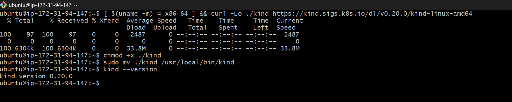
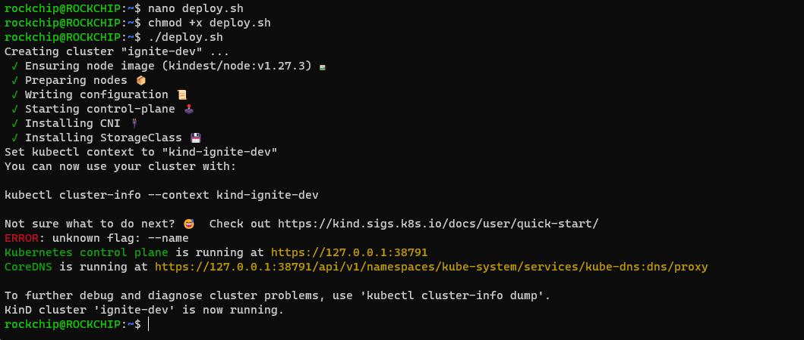
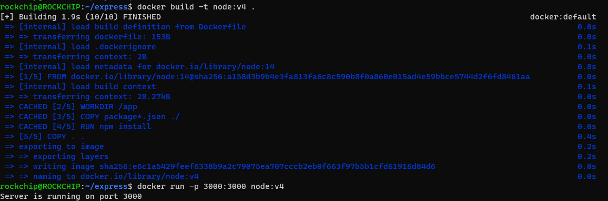
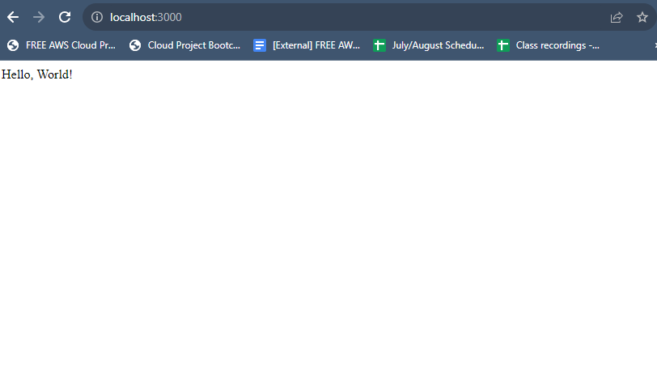
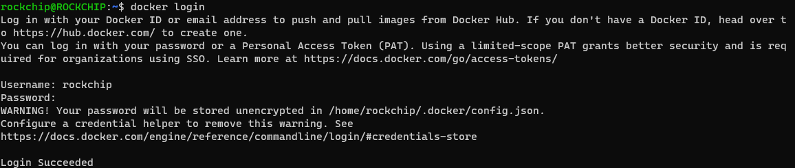
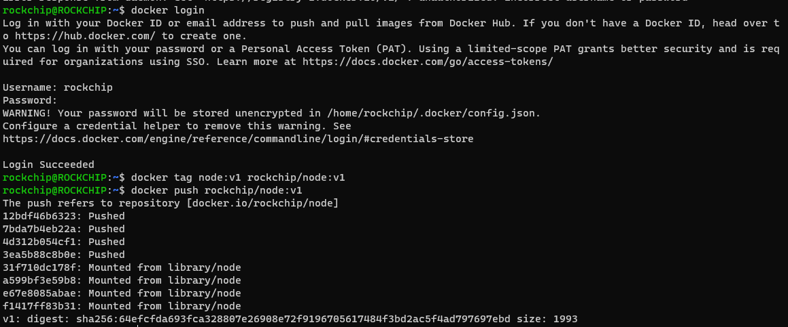

# ignite.dev

## Task instructions

Setup a kubernetes cluster using kind

1. Install kind 

```
[ $(uname -m) = x86_64 ] && curl -Lo ./kind https://kind.sigs.k8s.io/dl/v0.20.0/kind-linux-amd64

chmod +x ./kind

sudo mv ./kind /usr/local/bin/kind
```



2. Install Docker Engine
[Install](https://docs.docker.com/engine/install/ubuntu/)

3. Install kubectl
[Kubectl](https://kubernetes.io/docs/tasks/tools/install-kubectl-linux/)

Write a simple bash script that deploys a kind cluster locally

1. Create bash script and deploy it



Download the kubeconfig for the cluster and store in a safe place, we will use it much later in the next steps

`kubectl config view --minify --raw > kubeconfig.yml`

## Deploy a sample Node.js app using terraform

When kind is up and running, dockerize a simple hello world express and deploy to dockerhub









create a kubernetes deployment manifest to deploy to deploy the Node.js to the kind cluster but don't apply it yet

using the kubectl terraform provider, write a terraform code to deploy the kubectl manifest to the kind cluster

## Bonus

Using the kube-prometheus stack, using terraform helm provider, setup monitoring and observability for the prometheus cluster.
